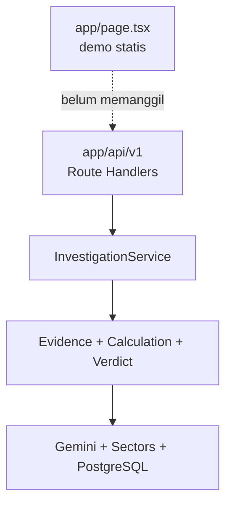
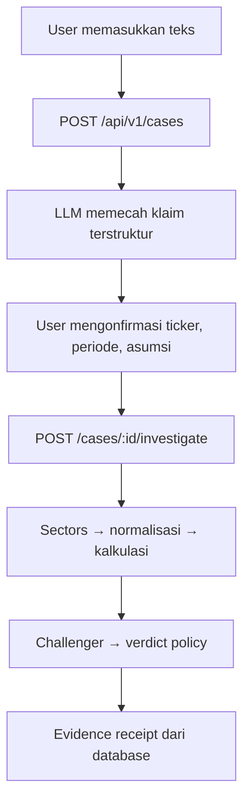

# Audit Teknis BursaBukti — Next.js

> Tanggal pemeriksaan: 14 September 2026  
> Bahan yang diperiksa: repository `COBA_SECT0R_HAKATHON-main (1).zip`, dokumen pedoman produk, dokumentasi resmi Sectors API v2, serta aturan Sectors Hackathon 2026.

## Kesimpulan paling penting

**Next.js adalah pilihan yang tepat dan tidak perlu diganti.** Fondasi backend kalian juga sudah lumayan: ada App Router, Prisma, PostgreSQL, gateway Sectors, cache, retry, mesin hitung deterministik, verdict policy, dan 22 automated tests yang lulus.

Namun, **aplikasi belum siap didemokan sebagai produk yang benar-benar bekerja**. Masalah terbesar adalah halaman utama masih berupa simulasi. Tombol investigasi hanya menjalankan `setTimeout(1200)` dan kemudian menampilkan hasil serta angka yang sudah ditulis langsung di `app/page.tsx`. UI belum memanggil endpoint kasus, Gemini, investigasi, Sectors, database, maupun evidence receipt.

Jika repository ini dikirim dalam keadaan sekarang, risikonya bukan sekadar nilai teknis berkurang. Aturan lomba mewajibkan alur inti bekerja end-to-end, memakai Sectors sebagai sumber inti, dan penilaian teknis secara eksplisit memeriksa apakah produk benar-benar berfungsi dan **tidak dipalsukan untuk demo**.

### Putusan audit saat ini

| Bagian | Kondisi | Kesimpulan |
|---|---|---|
| Pilihan stack Next.js | Baik | Pertahankan |
| Desain modular monolith | Baik secara konsep | Pertahankan, sederhanakan duplikasi |
| Frontend ke backend | Belum terhubung | Penghambat utama |
| Integrasi Sectors | Client sudah ada, belum tervalidasi end-to-end | Perlu koreksi kontrak dan live test |
| LLM/AI | Baru dipakai untuk memecah klaim | Belum cukup membuktikan orkestrasi agent lengkap |
| Mesin hitung | Sudah ada dan punya unit test | Fondasi bagus, tetapi pemilihan periode salah |
| Evidence receipt | Struktur dasar ada | Belum cukup untuk reproduksi/audit penuh |
| Database | Schema cukup matang | Ada ketidaksesuaian schema dan tidak ada migration di ZIP |
| Testing | 22 test lulus | Semuanya fixture/mock; belum ada live/contract/E2E test |
| Build | `npm run build` berhasil | Positif |
| Instalasi bersih | `npm ci` gagal | Harus diperbaiki |
| Lint | `npm run lint` gagal | Harus diperbaiki |
| Kesiapan submission hari ini | Belum lolos product-works gate | Jangan rekam video final dulu |

---

## 1. Masalah produk yang sebenarnya

Masalah yang ingin BursaBukti selesaikan sudah kuat dan relevan:

> Investor ritel menerima satu narasi saham yang mencampurkan angka, perbandingan, opini, dan prediksi, tetapi sulit memeriksa setiap bagian secara cepat dan bertanggung jawab.

Contohnya:

> “Laba BBCA naik 20%, asing akumulasi 10 hari, valuasinya paling murah, jadi harganya bakal naik dua kali lipat.”

Kalimat tersebut bukan satu klaim. Sistem harus memecahnya menjadi:

1. Klaim pertumbuhan laba.
2. Klaim arus dana asing.
3. Klaim perbandingan valuasi.
4. Prediksi harga masa depan.

Nilai utama BursaBukti bukan “AI yang tahu berita benar atau salah”. Nilai utamanya adalah **protokol pemeriksaan**:

- AI memahami bahasa manusia dan memecah klaim;
- sistem menentukan klaim mana yang dapat diuji;
- Sectors menyediakan data inti;
- kode menghitung angka, bukan LLM;
- agent penantang mencari konteks yang hilang;
- verdict policy memberi putusan yang konsisten;
- pengguna dapat melihat sumber, periode, rumus, asumsi, dan keterbatasan.

Fokus ini lebih meyakinkan daripada menjanjikan “pendeteksi hoaks saham”, karena sistem tidak mengaku mengetahui kebenaran mutlak.

---

## 2. Struktur program yang ada sekarang

Struktur yang berjalan saat ini secara garis besar:



### Bagian yang sudah tepat

- `app/api/v1/*` memakai Next.js App Router dan Node.js runtime.
- `lib/server/sectors/client.ts` menjadi gateway server-side sehingga API key tidak dikirim ke browser.
- Matematika ditempatkan dalam pure functions di `lib/server/calculations/service.ts`.
- Prisma memisahkan `Case`, `Claim`, `EvidenceRecord`, `Calculation`, `Verdict`, `ProviderRequest`, `AgentRun`, dan cache.
- Ada timeout, retry, cache, content hash, dan audit log dasar.
- Verdict memiliki empat hasil yang cocok dengan konsep produk.
- Build produksi berhasil dan 22 unit/integration test berbasis fixture lulus.

### Struktur ganda yang harus dibersihkan

Ada dua jalur implementasi paralel:

| Implementasi aktif | Implementasi duplikat/tidak terpakai |
|---|---|
| `lib/server/sectors/client.ts` | `server/sectors/client.ts` |
| `lib/server/calculations/service.ts` | `server/calculations/index.ts` |
| `lib/server/policies/verdict-service.ts` | `server/policies/verdict-policy.ts` |
| Enum Prisma berbahasa Inggris | `schemas/index.ts` dengan enum Indonesia berbeda |

Implementasi di `server/sectors/client.ts` bahkan memiliki endpoint tebakan, format autentikasi berbeda, dan otomatis memakai mock jika key kosong. Walaupun tampaknya tidak di-import, keberadaannya membuat tim mudah memperbaiki file yang salah atau tanpa sengaja mengaktifkan data palsu.

**Keputusan:** gunakan hanya jalur `lib/server/*`, lalu hapus folder duplikat setelah memastikan tidak ada import.

---

## 3. Alur yang terjadi sekarang versus alur yang harus terjadi

### Alur aktual saat tombol ditekan

1. User mengubah textarea.
2. Ticker di layar tetap `ABCD`.
3. Tombol menjalankan timer 1,2 detik.
4. UI menampilkan hasil hardcoded.
5. Mengubah PER/PBV hanya mengganti kalimat dan badge hardcoded.

Tidak ada network request ke `/api/v1/cases`. Tidak ada record database. Tidak ada pemanggilan Gemini. Tidak ada data Sectors. Tidak ada perhitungan berdasarkan input user.

### Alur minimum yang wajib benar-benar bekerja



Untuk hackathon, proses boleh sinkron dahulu. Jika proses lebih dari beberapa detik, halaman dapat melakukan polling `GET /api/v1/cases/:id` dan menampilkan status nyata, bukan animasi palsu.

---

## 4. Temuan teknis prioritas kritis

### P0 — Harus selesai sebelum fitur tambahan

#### 4.1 UI masih merupakan demo palsu

Lokasi: `app/page.tsx`

- `setTimeout` menggantikan investigasi asli.
- Input apa pun menghasilkan hasil yang sama.
- Ticker selalu `ABCD`.
- Angka laba, ranking peer, dan verdict ditulis langsung dalam JSX.
- Label “Powered by Sectors API” tampil walaupun alur tersebut tidak memanggil Sectors.

**Perbaikan:** buat state berdasarkan respons API: `idle → extracting → confirmation → investigating → completed/error`. Semua claim card harus dirender dari receipt.

#### 4.2 Data klaim yang ditulis ke Prisma tidak cocok dengan schema

Lokasi: `app/api/v1/cases/route.ts` dan `prisma/schema.prisma`

Route menulis:

- `periodLabel`
- `confidenceScore`

Tetapi model `Claim` tidak memiliki kedua field tersebut. Prisma memakai `periodStart` dan `periodEnd`. Karena object dibentuk melalui `.map()`, build TypeScript dapat tetap lolos, tetapi Prisma berpotensi menolak field tidak dikenal saat runtime.

**Perbaikan yang disarankan:** tambahkan `periodLabel` dan `confidenceScore` ke schema untuk MVP, tetap sediakan `periodStart/periodEnd` jika sudah dapat diparsing, buat migration, lalu test POST nyata ke PostgreSQL.

#### 4.3 Periode laporan keuangan dinormalisasi secara salah

Lokasi: `lib/server/sectors/normalizers.ts`

Respons resmi quarterly financials memakai field tanggal seperti `date: "2026-03-31"`. Normalizer sekarang:

- tidak menggunakan `date` untuk mendapatkan tahun;
- jika tahun tidak ditemukan, memakai tahun saat ini;
- mencoba mencari kuartal menggunakan regex pada seluruh string tanggal;
- angka pertama `1–4` dalam `2026-03-31` dapat terbaca sebagai nomor kuartal yang salah.

Akibatnya data lama dapat diberi label tahun sekarang dan kuartal yang keliru.

**Perbaikan:** parse `date` sebagai tanggal; tentukan kuartal dari bulan `03/06/09/12`; jangan pernah memakai tahun atau Q1 buatan saat parsing gagal. Jika format tidak valid, return error schema atau `null` dan verdict `NOT_VERIFIABLE`.

#### 4.4 Sistem mengabaikan periode yang disebut user

`FinancialEvidenceService` selalu memilih record pertama sebagai periode sekarang dan index ke-4 untuk YoY. Klaim “Q2 2025” tetap dapat diperiksa memakai kuartal terbaru.

Jika data YoY hanya memiliki kurang dari lima kuartal, kode diam-diam memakai index 1—artinya membandingkan kuartal berurutan—tetapi tetap dapat memperlakukannya sebagai YoY.

**Perbaikan:** cari record berdasarkan `fiscalYear + fiscalQuarter` klaim. Untuk YoY, cari kuartal yang sama pada tahun sebelumnya. Jika pasangan tidak ada, jangan ubah menjadi QoQ; hasilnya harus `NOT_VERIFIABLE`.

#### 4.5 Query peer valuation tidak sesuai kontrak screener v2

Lokasi: `ValuationEvidenceService` dan route peers.

- Kode memakai `order_by="pe_ttm asc"`, sedangkan dokumentasi v2 memakai nama field dengan awalan `-` untuk descending dan default ascending; kata `asc` bukan format yang didokumentasikan.
- Tidak mengirim `include_query_values=true`, sementara nilai yang dipakai untuk query dapat berada di `query_values`.
- Normalizer hanya mencari `rawCompany[metricName]`, bukan `rawCompany.query_values[metricName]`.
- Jika subsektor tidak diketahui, sistem membandingkan target dengan seluruh pasar dan tetap menyebutnya ranking peer/subsektor.
- Default limit Sectors adalah 50, sehingga ranking dapat memakai universe yang tidak lengkap.
- Symbol respons dapat berbentuk `BBCA.JK`, sedangkan target dapat berbentuk `BBCA`; pencarian target gagal jika suffix tidak dinormalisasi.

**Perbaikan:** ambil company report/screener target untuk menetapkan subsektor; validasi slug; query `where` untuk subsektor dan nilai non-null; gunakan `order_by=pe_ttm`, `include_query_values=true`, limit yang cukup/pagination; hilangkan suffix `.JK` secara konsisten.

#### 4.6 Foreign flow memilih hari yang salah

Endpoint resmi mengembalikan default rentang sekitar 30 hari jika `start/end` tidak diberikan. Kode meminta tanpa tanggal, lalu mengambil `slice(0, 10)` tanpa sorting. Belum ada jaminan bahwa itu 10 hari perdagangan terbaru.

Lebih berbahaya lagi, nilai yang hilang/NaN dinormalisasi menjadi `0`. Ini melanggar prinsip penting: **data hilang bukan berarti nol**.

**Perbaikan:** tentukan rentang tanggal eksplisit, sort berdasarkan tanggal descending, ambil 10 hari bursa, validasi setiap `net_foreign_inflow`, dan tandai bukti tidak cukup jika ada nilai invalid.

#### 4.7 Orkestrasi agent belum benar-benar ada

`InvestigationService` saat ini merupakan `if/else` dispatcher tiga jenis klaim. Ini bagus sebagai pondasi, tetapi belum memenuhi cerita empat agent di pedoman:

- tidak ada `Investigation Planner` yang menyimpan rencana tool;
- tidak ada `Evidence Challenger`;
- tabel `AgentRun` tidak digunakan;
- `counterEvidenceIds` selalu kosong;
- state `PLANNING_EVIDENCE`, `CALCULATING`, `CHALLENGING`, `JUDGING`, dan `GENERATING_RECEIPT` tidak dilalui;
- corporate action, ownership/filing, dan price statement selalu jatuh ke non-testable walaupun disebut sebagai tipe yang didukung.

**Perbaikan MVP:** implementasikan tiga peran yang benar-benar dapat dibuktikan:

1. **Claim Analyst:** LLM menghasilkan structured claims tervalidasi Zod.
2. **Evidence Planner/Tool Router:** aturan buatan tim memetakan tipe klaim ke tool, periode, metrik, dan definition contract.
3. **Evidence Challenger:** kode/agent mengecek periode salah, peer universe, data kosong, outlier, kata absolut, dan bukti yang berlawanan.

Verdict akhir tetap diputuskan policy deterministik. Simpan setiap tahap ke `AgentRun`.

#### 4.8 Fallback membuat emiten palsu `ABCD`

Jika ticker tidak ditemukan, fallback Gemini memilih `ABCD`. `InvestigationService` juga memakai `ABCD` sebagai pilihan terakhir. Sistem lalu dapat meminta data emiten yang tidak pernah dimaksud user.

**Perbaikan:** tidak boleh ada ticker default. Ubah status menjadi `WAITING_FOR_USER` dan minta user memilih ticker.

---

## 5. Temuan backend dan keamanan penting

### 5.1 Validasi output LLM belum aman

Respons Gemini di-`JSON.parse` lalu dipetakan menggunakan `any`. Schema Zod untuk output agent belum digunakan. Model dapat mengirim enum salah, ticker tidak valid, confidence di luar 0–1, atau klaim kosong.

**Perbaikan:** buat `DecompositionResultSchema`; gunakan `safeParse`; reject/repair terkontrol; simpan model, prompt version, input hash, dan output terstruktur ke `AgentRun`.

### 5.2 Upload gambar belum memiliki kontrak yang benar

Route membaca `body.imageBase64`, tetapi `CreateCaseSchema` tidak mendefinisikannya. Tidak ada validasi MIME, batas ukuran, atau penanganan base64 rusak. Gemini selalu diberi MIME `image/jpeg` walaupun file dapat berupa PNG.

**Keputusan MVP:** selesaikan input teks lebih dahulu. Jika gambar ditambahkan, gunakan `multipart/form-data` atau object `{mimeType, base64}` dengan batas ukuran dan allowlist format.

### 5.3 Error API salah status

Route mengirim object biasa ke `jsonError` untuk kasus tidak ditemukan. Helper hanya mengenali instance `DomainError`; akibatnya kasus 404 berubah menjadi 500. `ZodError` juga berubah menjadi 500.

**Perbaikan:** buat `CaseNotFoundError`, tangani `ZodError` sebagai 400/422, dan sertakan `requestId` yang sama dari awal request.

### 5.4 State machine hanya nama, belum aturan

`transitionCaseStatus` memiliki komentar “strict”, tetapi tidak memeriksa transisi yang diizinkan. Error `InvalidCaseTransitionError` tidak digunakan. Saat Sectors gagal, kasus tidak diubah menjadi `NEEDS_RETRY` atau `FAILED`.

**Perbaikan:** definisikan peta transisi legal; bungkus investigasi dengan `try/catch/finally`; bedakan retryable provider error dan fatal validation error.

### 5.5 Re-run membuat duplikasi

Pemanggilan investigasi berulang dapat membuat `Calculation` dan `EvidenceRecord` baru untuk claim yang sama. Verdict memang di-upsert, tetapi bukti/kalkulasi tidak idempotent.

**Perbaikan:** tambahkan `investigationRunId` atau `AgentRun` sebagai run scope; gunakan transaction; return receipt dari run terbaru; cegah dua investigasi paralel untuk case yang sama.

### 5.6 Evidence hash belum benar-benar canonical

`JSON.stringify(payload, Object.keys(payload).sort())` hanya aman untuk key tingkat atas. Replacer array dapat menghilangkan key object yang bersarang sehingga payload berbeda berpotensi menghasilkan canonical representation yang tidak lengkap.

**Perbaikan:** gunakan recursive stable JSON serialization sebelum SHA-256.

### 5.7 Evidence belum terhubung ke provider request

Sectors client membuat `ProviderRequest`, tetapi tidak mengembalikan ID-nya kepada evidence service. Akibatnya `providerRequestId` pada evidence hampir selalu kosong dan rantai sumber belum lengkap.

**Perbaikan:** return `{data, providerRequestId, retrievedAt, cacheHit}` dari gateway. Evidence harus menyimpan request ID tersebut.

### 5.8 Receipt belum cukup untuk reproduksi

Receipt saat ini menampilkan ID, operation, period label, timestamp, hash, nama formula, input, dan result. Namun belum menampilkan:

- `sourceName` dan data-as-of;
- parameter request yang sudah disanitasi;
- normalized values dan unit;
- formula version;
- peer universe serta excluded peers;
- asumsi user;
- counter evidence;
- alasan data tidak cukup;
- status cache/live.

Tanpa ini, user belum dapat mengulang pemeriksaan secara penuh.

### 5.9 Endpoint publik belum memiliki pembatasan

Jika nanti di-deploy, siapa pun dapat membuat kasus, membaca daftar 20 kasus terakhir, memicu pemakaian kredit Sectors/Gemini, dan melihat input user. Ini berisiko menghabiskan 1.000 kredit serta membocorkan teks yang ditempel pengguna.

**Perbaikan hackathon:** minimal rate limit, jangan tampilkan GET semua kasus secara publik, batasi panjang input, dan sediakan demo key/session sederhana. Autentikasi penuh bukan prioritas jika hanya demo lokal.

---

## 6. Masalah setup, build, dan test yang terbukti

Pemeriksaan dilakukan dari ZIP bersih.

| Perintah | Hasil | Arti |
|---|---|---|
| `npm ci` | Gagal | Konflik peer dependency: Vitest 5 meminta tipe Node 22/24+, proyek memakai `@types/node@20` |
| `npm ci --legacy-peer-deps` | Berhasil | Hanya jalan dengan bypass kompatibilitas |
| `npm run db:generate` | Berhasil | Prisma client dapat dihasilkan |
| `npm run build` | Berhasil | Next.js production build lolos |
| `npm run test` | 22/22 lulus | Seluruh tes memakai fixture/mock |
| `npm run lint` | Gagal | Script `next lint` tidak berlaku pada Next.js 16 |
| `npm run typecheck` sebelum build | Gagal pada `LayoutProps` | Global generated type belum tersedia |
| `npm run typecheck` setelah build | Berhasil | Tergantung generated `.next/types` |

### Perbaikan setup

- Samakan runtime ke Node 22 LTS dan `@types/node` versi yang kompatibel, atau turunkan Vitest ke versi yang cocok.
- Ubah lint menjadi `eslint .`.
- Ubah `RootLayout` props menjadi tipe eksplisit `{ children: React.ReactNode }`, atau tambahkan langkah resmi type generation sebelum typecheck.
- Commit folder migration Prisma, bukan hanya `schema.prisma`.
- Tambahkan CI: install → prisma generate → lint → typecheck → test → build.
- Tambahkan test route dengan database nyata dan contract fixtures berbentuk persis seperti respons Sectors v2.

### Mengapa 22 test lulus belum cukup

Fixture dibuat agar sesuai dengan asumsi normalizer, bukan sesuai penuh dengan respons resmi terbaru. Contohnya fixture financial memiliki `fiscal_year`, `quarter_label`, dan `net_income`, sedangkan contoh resmi Sectors menggunakan `date` dan `earnings`. Karena itu test lulus tetapi normalizer produksi tetap dapat salah.

---

## 7. Struktur program Next.js yang direkomendasikan

Jangan pindah ke microservices. Untuk waktu hackathon, modular monolith adalah pilihan paling aman. Struktur target yang cukup rapi:

```text
app/
  page.tsx
  api/v1/cases/
    route.ts
    [caseId]/
      route.ts
      investigate/route.ts
      receipt/route.ts

components/
  claim-input.tsx
  claim-confirmation.tsx
  investigation-progress.tsx
  claim-card.tsx
  evidence-drawer.tsx

lib/server/
  ai/
    claim-analyst.ts
    schemas.ts
    prompts.ts
  investigation/
    orchestrator.ts
    planner.ts
    challenger.ts
    state-machine.ts
  sectors/
    client.ts
    contracts.ts
    normalizers.ts
    cache.ts
  evidence/
    financial-growth.ts
    foreign-flow.ts
    relative-valuation.ts
    evidence-service.ts
  calculations/
    growth.ts
    foreign-flow.ts
    peer-ranking.ts
  verdict/
    policy.ts
  repositories/
    case-repository.ts
  api/
    response.ts
    errors.ts
  db.ts
  env.ts

prisma/
  schema.prisma
  migrations/

tests/
  unit/
  contract/
  integration/
  e2e/
```

Tujuannya bukan memperbanyak folder. Tujuannya agar setiap aturan memiliki satu rumah dan satu implementasi.

---

## 8. Kontrak alur implementasi yang disarankan

### Tahap A — Buat kasus dan pecah klaim

`POST /api/v1/cases`

Input:

```json
{
  "originalInput": "Laba BBCA Q2 2026 naik 20% YoY dan asing akumulasi 10 hari.",
  "inputType": "TEXT"
}
```

Output belum berupa verdict. Output harus berupa case dan klaim untuk dikonfirmasi:

```json
{
  "caseId": "...",
  "status": "WAITING_FOR_USER",
  "detectedTicker": "BBCA",
  "claims": [
    {
      "type": "FINANCIAL_GROWTH",
      "metric": "earnings",
      "period": { "year": 2026, "quarter": 2 },
      "comparison": "YOY",
      "claimedValue": 20,
      "isTestable": true
    }
  ]
}
```

Jika ticker/periode tidak jelas, UI meminta konfirmasi. Jangan menebak.

### Tahap B — Konfirmasi definisi dan asumsi

Untuk “paling murah”, user harus melihat asumsi:

- metrik: PER TTM;
- pembanding: subsektor yang sama;
- tanggal: data terbaru tersedia;
- peer negatif/null dikeluarkan.

User dapat lanjut dengan default atau menggantinya.

### Tahap C — Investigasi

Planner menghasilkan rencana terstruktur, misalnya:

```json
{
  "claimId": "...",
  "tools": ["quarterly_financials"],
  "requiredPeriods": ["Q2-2026", "Q2-2025"],
  "metric": "earnings",
  "formula": "yoy_growth_v1"
}
```

Gateway mengambil data, memvalidasi schema resmi, menormalisasi tanpa membuat nilai, menyimpan provider request dan evidence, lalu mesin hitung menghasilkan hasil deterministik.

### Tahap D — Challenger

Challenger bukan agent yang sekadar “berdebat”. Ia menjalankan checklist konkret:

- Apakah definisi laba cocok?
- Apakah periode persis sama?
- Apakah YoY benar-benar membandingkan kuartal sama tahun lalu?
- Apakah basis tahun lalu nol/sangat kecil/negatif?
- Apakah kata “paling murah” memakai peer yang lengkap?
- Apakah foreign flow positif total tetapi tidak positif setiap hari?
- Apakah data terlambat atau kosong?

Hasil checklist masuk ke policy dan receipt.

### Tahap E — Verdict dan receipt

LLM boleh menjelaskan hasil dengan bahasa awam, tetapi tidak boleh menentukan angka atau verdict sendiri. Penjelasan harus hanya memakai object hasil yang sudah dihitung.

---

## 9. Scope MVP yang realistis dan kuat untuk menang

### Wajib benar-benar berfungsi

1. Input teks.
2. Deteksi ticker dan dekomposisi multi-klaim oleh LLM.
3. Konfirmasi/edit klaim.
4. Tiga klaim terukur:
   - pertumbuhan earnings/revenue YoY;
   - foreign flow N hari;
   - PER/PBV relatif terhadap subsektor.
5. Prediction/opinion diberi `NOT_VERIFIABLE` dengan alasan.
6. Sectors live sebagai data inti.
7. Calculation formula yang transparan.
8. Challenger checklist.
9. Receipt yang dapat dibuka per klaim.
10. Error state yang jujur ketika key/data/provider bermasalah.

### Boleh ditunda

- upload screenshot/OCR;
- login penuh;
- corporate action;
- ownership/filing direksi;
- integrasi broker/IDX;
- streaming token;
- notifikasi;
- mobile app;
- rekomendasi dan eksekusi transaksi—yang terakhir memang dilarang lomba.

Tiga claim type yang dalam dan benar lebih meyakinkan daripada delapan claim type yang setengah jadi.

---

## 10. Urutan pengerjaan tim

### Hari 1 — Jadikan repository dapat dipercaya

- Perbaiki `npm ci`, lint, typecheck.
- Hapus implementasi duplikat.
- Sinkronkan Prisma schema dan create-case DTO.
- Buat migration awal.
- Perbaiki error 400/404/429/502.

**Selesai jika:** clone baru dapat menjalankan install, migration, test, dan build tanpa bypass.

### Hari 2–3 — Satu vertical slice live

- Hubungkan textarea ke `POST /api/v1/cases`.
- Tampilkan hasil dekomposisi untuk konfirmasi.
- Jalankan satu klaim financial growth dengan BBCA dan Sectors live.
- Render receipt dari database, bukan constant UI.

**Selesai jika:** mengubah angka/periode input mengubah data, perhitungan, dan verdict.

### Hari 4 — Benarkan kontrak data

- Zod schema respons Sectors.
- Parse tanggal kuartal.
- Match periode exact.
- Hilangkan missing-to-zero dan ticker default.
- Contract tests dari contoh respons resmi.

### Hari 5 — Foreign flow

- Rentang tanggal eksplisit.
- 10 hari bursa terbaru.
- Bedakan total net buy dan net buy setiap hari.
- Tampilkan positive/negative days dan data-as-of.

### Hari 6 — Relative valuation

- Temukan subsektor target.
- Query peer universe yang benar.
- Normalisasi `.JK`.
- Exclusion rules dan ranking reproducible.
- Simpan dataset peer atau fingerprint lengkap sebagai evidence.

### Hari 7 — Agent orchestration

- Simpan Claim Analyst, Planner, dan Challenger ke `AgentRun`.
- Jalankan state machine nyata.
- Isi counter evidence dan limitations.
- LLM hanya membuat penjelasan dari hasil terstruktur.

### Hari 8 — E2E dan failure rehearsal

- Test satu kasus sukses multi-klaim.
- Test ticker tidak ditemukan.
- Test data kuartal kurang.
- Test Sectors 401/429/timeout.
- Test Gemini gagal tetapi sistem meminta konfirmasi atau memakai fallback berlabel.
- Test re-run tidak mencampur bukti lama.

### Hari 9–10 — UX dan video

- Loading progress berdasarkan status nyata.
- Evidence drawer yang mudah dipahami.
- Label `LIVE DATA` atau `DEMO FIXTURE` yang tidak dapat tertukar.
- Rekam video hanya setelah menjalankan kasus baru dari input sampai receipt.
- Sisakan waktu untuk retake dan bug fixing sebelum repository freeze.

---

## 11. Checklist “siap direkam untuk juri”

Jangan merekam video final sebelum semua jawaban di bawah adalah “ya”:

- [ ] Input berbeda menghasilkan klaim dan hasil berbeda.
- [ ] Tidak ada `setTimeout` yang berpura-pura sebagai investigasi.
- [ ] Tidak ada angka hasil market/financial hardcoded pada UI produksi.
- [ ] Network tab menunjukkan request ke backend BursaBukti.
- [ ] Database mencatat case, claim, provider request, evidence, calculation, verdict, dan agent run.
- [ ] Sectors API key hanya berada di server environment.
- [ ] Minimal satu live Sectors request terlihat pada audit receipt/log tersanitasi.
- [ ] Periode klaim cocok dengan dua periode yang dihitung.
- [ ] Formula dan angka input tampil ke user.
- [ ] Peer group dan exclusion rule terlihat.
- [ ] Missing data menghasilkan `NOT_VERIFIABLE`, bukan angka nol.
- [ ] Prediksi harga tidak menghasilkan rekomendasi beli/jual.
- [ ] Jika Sectors/Gemini gagal, UI menampilkan error jujur dan dapat dicoba ulang.
- [ ] `npm ci`, lint, typecheck, test, dan build lulus di clone bersih.
- [ ] README setup dapat diikuti anggota tim lain.
- [ ] Public repo tidak mengandung `.env` atau API key.

---

## 12. Cara menyampaikan produk tanpa overclaim

### Kalimat yang aman dan kuat

> “BursaBukti memakai LLM untuk memahami dan memecah narasi, Sectors sebagai sumber data inti, serta kode deterministik dan verdict policy buatan kami untuk menghitung dan menguji setiap klaim.”

> “Setiap hasil membawa periode, rumus, asumsi, sumber, data-as-of, dan keterbatasan sehingga pengguna tidak diminta percaya buta kepada AI.”

> “Hari ini kami membuktikannya sebagai website Next.js. Arsitekturnya dapat dikembangkan menjadi API untuk fitur pemeriksaan klaim pada broker atau kanal edukasi pasar modal.”

### Kalimat yang jangan digunakan sebelum fiturnya ada

- “BursaBukti sudah terintegrasi dengan IDX atau broker.”
- “Empat agent kami sudah saling menantang,” jika `AgentRun` dan challenger belum ada.
- “Semua berita dapat ditentukan benar atau salah.”
- “Data ini real-time,” jika yang tersedia end-of-day/filing-based.
- “Evidence immutable,” jika database masih mengizinkan update tanpa perlindungan.
- “Demo menggunakan Sectors live,” jika yang tampil masih hardcoded/fixture.

---

## 13. Mengapa perbaikan ini meningkatkan peluang menang

Penilaian resmi memberi bobot terbesar pada real-world usability (40%), lalu video/storytelling (30%), dan technical depth/execution (30%). Struktur yang direkomendasikan memperkuat ketiganya sekaligus:

- **Usability:** user dapat memeriksa klaim nyata hari ini, bukan membaca demo contoh.
- **Storytelling:** perubahan dari narasi campur-aduk menjadi nutrition label bukti terlihat jelas di layar.
- **Technical depth:** juri dapat melihat orkestrasi buatan tim, Sectors sebagai sumber inti, kalkulasi deterministik, challenger, state, dan audit trail.

Faktor “wow” BursaBukti seharusnya bukan animasi atau jumlah agent. Faktor wow-nya adalah momen ketika satu kalimat yang terdengar meyakinkan berubah menjadi beberapa verdict berbeda—satu didukung, satu didukung sebagian, satu bertentangan, dan satu memang tidak dapat diverifikasi—dengan alasan yang dapat dibuka dan dihitung ulang.

---

## Referensi resmi yang dipakai

- [Sectors Hackathon 2026 — Official Rules](https://hackathon.sectors.app/rules)
- [Track 01 — AI Agents & Assistants](https://hackathon.sectors.app/tracks/ai-agents-assistants)
- [Sectors Financial API v2 — Get Started](https://docs.sectors.app/get-started/v2/overview)
- [Sectors v2 — Companies Screener](https://docs.sectors.app/api-references/v2/indonesia/screener/companies)
- [Sectors v2 — Daily Net Foreign Inflow](https://docs.sectors.app/api-references/v2/indonesia/brokers/foreign-flow-by-symbol)
- [Sectors v2 — Company Quarterly Financials](https://docs.sectors.app/api-references/v2/indonesia/report/quarterly-financials)
- [Sectors v2 — Corporate Actions](https://docs.sectors.app/api-references/v2/indonesia/company/corporate-actions)
- [Sectors v2 — Shareholders Composition](https://docs.sectors.app/api-references/v2/indonesia/company/shareholders-composition)

